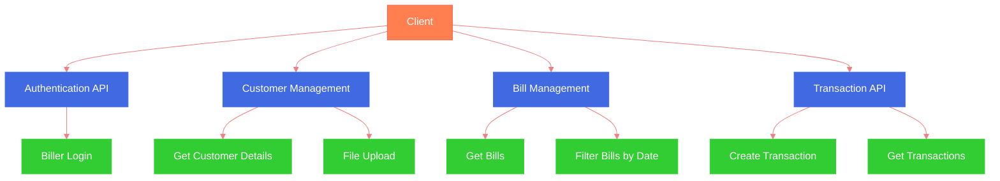

# Plutos ERP Backend API Documentation

# 🏢 Plutos ERP Backend

Version 1.0 | February 2025

API for Donation and Offline Billers

## 🔐 Authentication Flow

### 1. Biller Login

**Endpoint:** POST http://localhost:3000/biller/login/

**Request Body:**

```json
{
    "email": "mayukh@gmail.com",
    "password": "123456"
}
```

**Response:**

```json
{
    "_id": "679c600262ab7357d36b5a53",
    "billerId": "NFPL00000NATZB",
    "email": "mayukh@gmail.com",
    "billerName": "Normal Finance",
    "billerCategory": "offline",
    "password": "$2b$10$6n.1Vs7QaGkv9LwZIdnsaemG6mdxfYO8OKdRhNf92t3eVe5dSRhRy",
    "__v": 0
}
```

<aside>
⚠️ Important: Store billerId in frontend state management (Redux) for subsequent requests

</aside>

## 👥 Customer Management

### 1. Get Customer Details

**Endpoint:** GET http://localhost:3000/customer/

**Request Body:**

```json
{
    "billerId": "RFPL00000NATZB"
}
```

### 2. File Upload 📤

**Endpoint:** POST http://localhost:3000/customer/upload/${billerId}

**Body:** Form-data with file attachment

Description:

- Uploads customer file using billerId
- Extracts and saves customer data with current bills
- Automatically expires old bills for existing customers

## 📃 Bill Management

### 1. Get Bills

**Endpoint:** GET http://localhost:3000/bills/${customerId}

**Request Body:**

```json
{
    "expired": true/false
}
```

Description:

- Set expired=true to retrieve expired bills
- Set expired=false to retrieve active bills

### 2. Filter Bills by Date Range

**Endpoint:** GET http://localhost:3000/bills

**Request Body:**

```json
{
    "startDate": "2025-02-02",
    "endDate": "2025-02-04",
    "billerId": "RFPL00000NATZB"
}
```

## 💱 Transaction Flow

### 1. Create Transaction

**Endpoint:** POST http://localhost:3000/transaction/

**Request Body:**

```json
{
    "amount": "${amount}",
    "type": "${type}",
    "billerId": "${billerId}",
    "customerIdentifier": "${customerIdentifier}",
    "transactionRefId": "${transactionRefId}",
    "refId": "${refId}"
}
```

### 2. Get Transactions

**Endpoint:** GET http://localhost:3000/transaction/

**Request Body:**

```json
{
    "billerId": "RFPL00000NATZB"
}
```

## System Architecture Diagram



## 📞 Support

For technical assistance, please contact the Plutos Technical Team.
